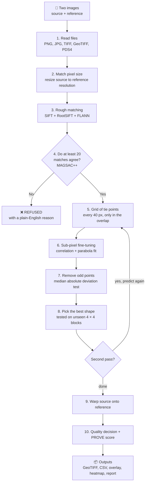

# 🌕 PS 26166: Lunar Image Registration

**Smart India Hackathon 2026 · Problem Statement 26166 · ISRO**

*Multi-modal, sun-angle and scale invariant image correspondence using Chandrayaan-2 optical images (OHRC, TMC-2, IIRS).*

Organisation: ISRO / Department of Space · Category: Software · Theme: Space Technology

**Team 404 Craters Not Found:** Manya Madaan, Shruti, Ananya Krishna

> **Our rule:** accuracy must be measured, not claimed.
> Every number in this README was measured by running our own code. Numbers from other people's work are marked as prior work.

---

## 📑 Contents

1. [The problem, in simple words](#1--the-problem-in-simple-words)
2. [Our answer, in one minute](#2--our-answer-in-one-minute)
3. [Our numbers](#3--our-numbers)
4. [How it works: the full workflow](#4--how-it-works-the-full-workflow)
5. [PROVE and the PROVE score (under the hood)](#5--prove-and-the-prove-score-under-the-hood)
6. [What happens when accuracy is high, medium, low or zero](#6--what-happens-when-accuracy-is-high-medium-low-or-zero)
7. [The 5 demo pairs](#7--the-5-demo-pairs)
8. [What you get from every run](#8--what-you-get-from-every-run)
9. [The website](#9--the-website)
10. [✅ Done so far](#10--done-so-far)
11. [⏳ Still to do](#11--still-to-do)
12. [Honest limitations](#12--honest-limitations)
13. [Checklist against the problem statement](#13--checklist-against-the-problem-statement)
14. [Run it yourself](#14--run-it-yourself)
15. [API](#15--api)
16. [Project layout](#16--project-layout)
17. [Tech stack, credits and references](#17--tech-stack-credits-and-references)

---

## 1. 🌑 The problem, in simple words

We have two photos of the **same place on the Moon**:

- **Source image**: taken by Chandrayaan-2 (for example the OHRC camera). This is the image we **move**.
- **Reference image**: an existing Moon map, for example from NASA's LRO NAC camera. This image **stays fixed**.

They never line up perfectly. Our software must:

1. **Find matching points** in both images ("this crater here is that crater there").
2. **Move and bend the source image** so every crater sits exactly on top of the same crater in the reference.
3. **Prove how good the result is** with numbers: RMSE, inlier count and inlier ratio.

ISRO wants this to work even when:

| Problem | What it means |
|---|---|
| ☀️ **Different sunlight** | The Sun lights craters from different sides, so shadows move or flip. |
| 👁️ **Different viewpoints** | Cameras see hills from different angles, so the image bends differently in each place. |
| 🔍 **Different zoom (scale)** | OHRC sees about 0.25 m per pixel, TMC-2 about 5 m, IIRS about 80 m. |
| 📷 **Different cameras** | Different brightness, contrast, noise and bit depth. |

And the result must be **sub-pixel** (error smaller than one pixel), with match points **spread evenly over the whole image**.

---

## 2. ⚡ Our answer, in one minute

We built a **coarse-to-fine registration engine** plus a **website** to run it and inspect the results.

1. **Rough step:** find similar-looking spots (SIFT features) and throw out the wrong ones (MAGSAC++).
2. **Fine step:** place a grid of points over the whole overlap and fine-tune each one to a **fraction of a pixel** using correlation.
3. **Pick the best shape:** try a flat transform, curved fits, and a curved fit plus a **local terrain correction**. Keep whichever predicts **parts of the image it never saw** best.
4. **Prove it:** measure the error on unseen blocks, show a heatmap of weak spots, give a **PROVE score**, and **refuse** pairs that do not match.

**No GPU, no deep learning, no paid tools.** It runs on a normal laptop CPU.

---

## 3. 📊 Our numbers

### 3.1 The main real test: Vikram landing site (Chandrayaan-3)

A 2 km × 2 km area around the Chandrayaan-3 landing site.

- **Source:** Chandrayaan-2 **OHRC** (resized to 1 m per pixel, 8-bit).
- **Reference:** NASA **LRO NAC** orthophoto (1 m per pixel, 16-bit, with map projection).

| | Old method (SIFT + RANSAC) | **Our engine** |
|---|---|---|
| Rough matches found | 28 | **1,724** |
| Good matches kept | 24 | **1,548** (89.8% of rough matches) |
| Sub-pixel tie points | none | **2,035** (94.8% of the 2,147 grid points in the overlap) |
| Image covered (8 × 8 grid) | 25% | **98%** |
| How evenly spread (1 = perfect) | 0.33 | **0.75** |
| Error the old script printed | 1.04 px (on its own points, too optimistic) | — |
| **Honest error on unseen blocks** | 1.26 px = 1.26 m | **0.50 px = 0.50 m** ✅ |
| Shape model | one flat transform | curved fit (degree 4) + local terrain correction |
| Quality decision | — | **ACCEPTED, sub-pixel ACHIEVED** |
| PROVE score | — | **5 / 5, STRONG** |
| Time on a laptop CPU | ~2 s | ~15 to 35 s |

**In short: about 2.5× more accurate and 85× more match points than the old method.**

### 3.2 Why picking the right shape matters

Honest error of every shape model, on the same 2,035 tie points:

| Shape model | Error on unseen blocks | What it tells us |
|---|---|---|
| Flat transform (homography) | 1.18 px | Too stiff for real terrain |
| Curved, degree 2 | 0.86 px | |
| Curved, degree 3 | 0.64 px | |
| Curved, degree 4 | 0.61 px | Best smooth curve |
| Curved, degree 5 | 0.82 px | Over-fits: looks good on random checks, caught by the block test |
| **Curved, degree 4 + local correction** | **0.50 px** | **Selected**: also follows small bends from craters and slopes |

### 3.3 Other things we measured

| Test | Result |
|---|---|
| Fine-tuning on test images with a known answer (10 random rotations and zooms, brightness change, noise) | Error dropped from 3.14 px to **0.044 px** on average (90% of points under 0.081 px) |
| Photo vs image made from NASA's height map (different kind of data) | **0.48 px = 1.44 m**, 5/5 STRONG |
| OHRC shrunk to 5 m per pixel (like TMC-2) | **0.89 px**, 4/5 MODERATE |
| Two images of different places | **Refused** in under 1 second |
| Sun from the opposite side (image made from the height map) | Match score flips from **+0.69 to −0.68**. The pattern is still there, only upside down. This is our biggest open problem. |
| Reading a real Chandrayaan-2 **IIRS** file (PDS4 format) | The band we read matches the product's own preview image with **0.88** correlation |
| Reading NASA's height map of the landing site | Heights 502 to 555 m, matching the published landing-site height of about 532 m |
| Automated tests | **41 tests**, all passing |

---

## 4. 🔧 How it works: the full workflow



### Step by step, in simple words

| # | Step | What happens | Technical name |
|---|---|---|---|
| 1 | **Read the files** | Opens PNG, JPG, WebP, TIFF and GeoTIFF (8 or 16-bit) and Chandrayaan-2 **PDS4** files. Keeps the full brightness range, marks missing pixels, and reads pixel size, map position and footprint from the file. For huge spectral files it reads only one band. | tifffile, memory-mapped PDS4 reader |
| 2 | **Match pixel size** | If both pixel sizes are known, the source is resized so one pixel covers the same ground in both images, while exact positions are tracked. | Resampling with pixel-centre bookkeeping |
| 3 | **Rough matching** | Finds distinctive spots in smaller copies of both images (half size, long side at most 3,000 px) and pairs them. A pair is kept only if it is clearly better than the second-best choice (ratio 0.8) and matches in both directions. | SIFT, RootSIFT, FLANN, Lowe ratio test, mutual check |
| 4 | **Throw out wrong matches** | Keeps only matches that agree on one alignment (3 px tolerance). **If fewer than 20 agree, the pair is refused** with a clear reason. At most 25 matches per 8 × 8 grid cell are used, so one busy area cannot take over. | MAGSAC++ homography, grid balancing |
| 5 | **Grid of tie points** | Places a point every 40 px, **only where the two images overlap** and the reference has data. | Overlap crop |
| 6 | **Sub-pixel fine-tuning** | Each point gets a 48 × 48 px patch. The engine searches ±6 px around the predicted spot for the best match, fits a parabola to the peak to get a fraction of a pixel, and repeats up to 3 times. Flat or dark patches, and weak matches (score below 0.5), are skipped. | Normalised cross-correlation (NCC) + parabolic peak fit |
| 7 | **Remove odd points** | Points far off compared with the others are dropped (more than 3 robust standard deviations). This uses the smooth models only, because the local model passes through every point and would hide mistakes. | Median absolute deviation (MAD) test |
| 8 | **Pick the best shape** | Tries 6 models. Each is fitted **without** one 4 × 4 block of the image and tested **on** that block, for all 16 blocks. The lowest error wins. If a simpler model is within 2%, the simpler one wins. | Spatial-block hold-out cross-validation |
| 9 | **Second pass** | Steps 5 to 8 run again, now predicting with the chosen model. This improves points near the edges. | Predict, measure, correct |
| 10 | **Local terrain correction** | The leftover shifts of the curved fit are placed on the tie-point grid. Gaps are filled smoothly (Laplace equation), and the field is interpolated between points (cubic B-splines). | Harmonic residual field + B-spline |
| 11 | **Warp and save** | The source is moved onto the reference grid and all outputs are written. | Cubic remap, GeoTIFF writer |
| 12 | **Judge the result** | Quality decision (ACCEPTED / REJECTED) and PROVE score (see below). | |

---

## 5. 🔬 PROVE and the PROVE score (under the hood)

### What is PROVE?

**PROVE = Predict, Refine, Only-if Validated Estimation**

It is the name of our method, and it describes how the engine thinks:

| Letter | Word | In our engine |
|---|---|---|
| **P** | **Predict** | The current model predicts where each point should land in the source image. |
| **R** | **Refine** | Correlation searches a small window around that prediction and finds the exact spot, to a fraction of a pixel. |
| **O-V** | **Only-if Validated** | A more complex correction (like the local terrain correction) is kept **only if** it predicts unseen image blocks better. Otherwise the simpler model stays. |
| **E** | **Estimation** | The final shape of the transformation is estimated from all validated points. |

We built PROVE from well-known building blocks (SIFT, MAGSAC++, correlation, least squares, splines, credited in section 17). The pipeline, the hold-out gate and the lunar-specific design are ours.

### What is the PROVE score?

The PROVE score answers one question: **how much evidence do we have that this registration is right?**

It is **not** a made-up number like "94/100". It is **5 measured checks**. Each check compares a number the engine measured with a fixed limit, and the website shows both.

| # | Check | What is measured | Pass if | Why it matters |
|---|---|---|---|---|
| 1 | **Sub-pixel on unseen blocks** | Error (RMSE) of tie points predicted by a model that never saw their block | **≤ 1.00 px** | The main target of the problem statement |
| 2 | **Rough matches agree** | Good matches ÷ all rough matches (the problem statement's inlier ratio) | **≥ 50%** | If most matches disagree, the alignment could be luck |
| 3 | **Image covered by tie points** | Share of the 8 × 8 image grid that has at least one tie point | **≥ 80%** | Proof must cover the whole image, not one corner |
| 4 | **Tie points spread evenly** | Uniformity = 1 ÷ (1 + coefficient of variation of points per cell). 1 means perfectly even. | **≥ 0.50** | A crowded area should not dominate |
| 5 | **No weak regions** | Share of grid cells (with tie points) whose own error is ≤ 1 px | **≥ 90%** | A good average can hide one bad area |

**Evidence level:**

| Checks passed | Evidence |
|---|---|
| 5 / 5 | 🟢 **STRONG** |
| 3 or 4 / 5 | 🟡 **MODERATE** (the website shows which check failed) |
| 0 to 2 / 5 | 🔴 **WEAK** |

**Worked example (zoom gap sample):**

```
Sub-pixel on unseen blocks     0.89 px  ≤ 1.00 px   ✅
Rough matches agree             76%     ≥ 50%       ✅
Image covered by tie points     98%     ≥ 80%       ✅
Tie points spread evenly        0.76    ≥ 0.50      ✅
Image cells with error ≤ 1 px   79%     ≥ 90%       ❌
→ 4 / 5 checks passed → EVIDENCE: MODERATE
```

**Honest notes:**

- The limits were chosen by our team and still need tuning on more image pairs. The website says this under the card.
- The PROVE score is stricter than the older quality decision. Example: OHRC shrunk to 8 m would still be ACCEPTED by the quality decision (its limit is 3 px), but PROVE calls it WEAK (2/5).
- All five checks use measurements the engine already makes, so the score costs no extra time.
- Code: [`backend/app/registration/prove.py`](backend/app/registration/prove.py), tests in [`backend/tests/test_prove.py`](backend/tests/test_prove.py).

### The quality decision (the older check, still shown)

| Rule | Limit |
|---|---|
| Error on unseen blocks | ≤ 3 px, or REJECTED |
| Tie-point ratio | ≥ 20%, or REJECTED |
| Image coverage | ≥ 25%, or REJECTED |
| Sub-pixel badge | ACHIEVED if error ≤ 1 px |

---

## 6. 📶 What happens when accuracy is high, medium, low or zero

We made the same real OHRC image harder and harder to match by shrinking it (like using a camera with less detail), then matched it to the 1 m NAC image:

| OHRC detail | Error | Rough matches agree | Good cells | PROVE | Evidence |
|---|---|---|---|---|---|
| 1 m (original) | 0.50 px | 90% | 95% | 5 / 5 | 🟢 STRONG |
| 3 m | 0.57 px | 89% | 94% | 5 / 5 | 🟢 STRONG |
| **5 m** (about TMC-2) | **0.89 px** | 77% | **79%** ❌ | **4 / 5** | 🟡 **MODERATE** |
| 8 m | 1.81 px ❌ | 46% ❌ | 0% ❌ | 2 / 5 | 🔴 WEAK |
| 10 m | 1.92 px ❌ | 41% ❌ | 2% ❌ | 2 / 5 | 🔴 WEAK |

*(The 3 m, 8 m and 10 m rows were one-off experiments; 1 m and 5 m are demo buttons on the website.)*

### What the user sees in each case

| Case | Example | What the engine does | What the website shows |
|---|---|---|---|
| 🟢 **High accuracy** | Vikram pair (0.50 px) | Aligns, all 5 checks pass | Green ACCEPTED, sub-pixel ACHIEVED, **PROVE 5/5 STRONG**, mostly blue heatmap, grey overlay |
| 🟡 **Medium: accuracy dropping** | Zoom gap 5 m (0.89 px) | Aligns, but some regions are weaker | ACCEPTED, sub-pixel ACHIEVED, **PROVE 4/5 MODERATE**, "Image cells with error ≤ 1 px: 79%" in red, more orange and red spots on the heatmap |
| 🟡 **Medium: good but incomplete proof** | Half overlap (0.53 px) | What overlaps is accurate, half the image has no points | ACCEPTED, **PROVE 3/5 MODERATE**, coverage 48% and evenness 0.47 in red, overlay half pink (no match) and half grey |
| 🔴 **Low accuracy** | OHRC at 8 m (1.81 px) | Aligns roughly, error above 1 px | Sub-pixel NOT ACHIEVED, **PROVE 2/5 WEAK** |
| 🔴 **Error too large** | Any pair above 3 px | Quality decision fails | Red REJECTED with the reason "RMSE is too high" |
| ⛔ **No match at all** | Two different places | Stops after the rough step: only 4 or 5 of 20 to 28 matches agree, 20 are needed | Red **REGISTRATION FAILED** box: *"The two images may not show the same area, may overlap too little, or may differ too much in lighting or scale."* No score, no fake result |

---

## 7. 🧪 The 5 demo pairs

All five are built from the real Vikram landing-site files. They appear as buttons on the website (`/matching`) when the files exist in `backend/data/`.

| Button | Reference | Source | Result |
|---|---|---|---|
| **Vikram landing site (Chandrayaan-3)** | NASA LRO NAC photo, 1 m | Chandrayaan-2 OHRC photo, 1 m | ACCEPTED · 0.50 px · 2,035 points · **5/5 STRONG** |
| **Photo vs height-map render (same site)** | NAC photo resized to 3 m | Image made from NASA's height map (DTM), 3 m, Sun at 330°, 10° high | ACCEPTED · 0.48 px (1.44 m) · 187 points · **5/5 STRONG** · about 2 s |
| **Zoom gap: 5 m vs 1 m (moderate)** | NAC photo, 1 m | OHRC shrunk to 5 m | ACCEPTED · 0.89 px · 2,059 points · **4/5 MODERATE** |
| **Half overlap (moderate)** | NAC photo, 1 m | Only the right half of OHRC | ACCEPTED · 0.53 px · 1,002 points · **3/5 MODERATE** |
| **Two different spots (should be rejected)** | Top-left 1 km of NAC | Bottom-right 1 km of OHRC (no shared ground) | **REFUSED** in under 1 s |

**Honest labels:** the height-map image, the 5 m OHRC and the half OHRC are made from real data by us, not new photos. The "photo vs height map" pair is not fully independent, because the NAC photo and the height map both come from NASA's LROC team.

The demo files are made by [`backend/scripts/build_demo_samples.py`](backend/scripts/build_demo_samples.py).

---

## 8. 📦 What you get from every run

| Output | What it is |
|---|---|
| `registered.tif` | The aligned source image as a GeoTIFF on the reference grid. If the reference has a map projection, the aligned image **sits in the right place on the Moon map** (opens in QGIS). |
| `registered.png` | The same aligned image, as a normal picture |
| `tie_points.csv` | Every match point: reference x, y · source x, y · its own error on unseen blocks · map coordinates in metres (when the reference is a GeoTIFF) |
| `overlay.jpg` | Reference in magenta, aligned source in green. **Grey means aligned.** |
| `error_heatmap.jpg` | Error of every part of the image: blue ≈ 0 px, red ≥ 2 px |
| `tie_points.jpg` | Both images side by side with lines joining matched points, coloured by error |
| JSON report | All numbers: metrics, quality decision, PROVE score, error of every model, error of each of the 64 grid cells, timings |

**Coordinates:** points are given in reference pixels. With a GeoTIFF reference they also get map coordinates in metres (the Vikram NAC uses a polar stereographic Moon projection). **Latitude and longitude are not computed yet.**

---

## 9. 💻 The website

**Landing page (`/`):**

- Scroll-driven hero animation
- Before/after registration demo
- The eight-layer architecture
- The three challenges (with real height-map images lit from the east and from the west)
- What the engine does (with the real global vs local heatmap)
- The processing pipeline
- The three Chandrayaan-2 cameras (real OHRC and IIRS frames)
- Real metrics from the Vikram run
- A "Coming next" list

**Workstation (all pages use real engine results, no demo data):**

| Route | Page | What it shows |
|---|---|---|
| `/overview` | Mission overview | The goal, the pipeline and a 3D Earth–Moon model |
| `/matching` | Registration workstation | Load one of the 5 sample pairs or upload your own two images, run the engine, see the quality decision, **PROVE score**, key numbers and overlay |
| `/heatmap` | Reliability heatmap | Error of each of the 64 image cells, with a cell inspector |
| `/features` | Tie-point coverage and match lines | Hexagon view of where the points are, and lines joining the same spot in both images, coloured by error |
| `/geospatial` | Geometry | Pixel sizes, image sizes, chosen model and the transform |
| `/results` | Full report | Everything above, model comparison, PROVE score, output images, and downloads (JSON report, CSV, GeoTIFF) |

English and Hindi. Some newer text (the PROVE card, sample labels, landing page wording) is English only for now.

---

## 10. ✅ Done so far

### Engine

- [x] Reads PNG, JPG, WebP, TIFF and GeoTIFF (8 and 16-bit, compressed TIFF, missing-data values, pixel size, map position)
- [x] Reads Chandrayaan-2 **PDS4** files, one band at a time; checked on a real IIRS file
- [x] Resizes the source to the reference pixel size with exact position tracking
- [x] Rough matching: SIFT + RootSIFT + FLANN + ratio test + two-way check, on smaller copies for speed
- [x] Wrong match removal with MAGSAC++ and grid balancing
- [x] **Refuses image pairs that do not match**, with a plain-English reason (at least 20 agreeing matches needed)
- [x] Regular grid of tie points, only inside the overlap
- [x] Sub-pixel fine-tuning by correlation (0.044 px on known-answer tests)
- [x] Odd-point removal (MAD test)
- [x] 6 shape models including a **local terrain correction**, picked by spatial-block hold-out
- [x] Two-pass predict, refine, correct loop
- [x] Honest error on unseen blocks, in pixels and metres
- [x] Coverage, evenness and per-cell error (8 × 8 grid)
- [x] Quality decision: ACCEPTED / REJECTED with reasons, sub-pixel ACHIEVED / NOT ACHIEVED
- [x] **PROVE score**: 5 measured checks, STRONG / MODERATE / WEAK
- [x] Outputs: aligned GeoTIFF (with map position) and PNG, tie-point CSV (with map coordinates), overlay, heatmap, match-line image, JSON report

### Results and experiments

- [x] Real Vikram landing-site pair: **0.50 px = 0.50 m**, 2,035 points, 98% coverage
- [x] Comparison with the old SIFT + RANSAC method (1.26 px, 24 points, 25% coverage)
- [x] Photo vs height-map image: 0.48 px
- [x] Accuracy vs zoom gap experiment (1, 3, 5, 8, 10 m)
- [x] Sun-flip experiment (+0.69 → −0.68 match score)
- [x] Evaluation script for the real pair: `backend/scripts/evaluate_vikram_site.py`

### Backend and website

- [x] FastAPI backend with upload checks (file type whitelist, 200 MB limit, safe file names)
- [x] Sample-pair API and **5 demo pairs**
- [x] Website connected to the engine: workstation, heatmap, hexagon coverage, match lines, geometry page, full report with downloads
- [x] PROVE score card on the workstation and the full report
- [x] Landing page rewritten in simple English, using real images and real numbers
- [x] English and Hindi interface

### Quality and documents

- [x] **41 automated tests**, all passing (`cd backend && pytest`)
- [x] Solution document updated (15 September 2026)
- [x] Slide text for the idea presentation

---

## 11. ⏳ Still to do

Ordered by importance.

### 🔴 Must do

- [ ] **Deploy the prototype:** website on **Vercel**, backend on **Render** (the backend cannot run on Vercel because uploads are large and a run can take 30 s). The demo image files must also be put on the server, because `data/` is not in git.
- [ ] **Work under different sunlight** (our biggest gap). Today the fine step handles brighter or darker images, but not shadows that flip side. Plan:
  1. Make test images for 24 sun directions from the height map and measure where the engine fails (a "failure map").
  2. Add math-based matching that ignores flipped shadows (doubled-angle gradient orientation, sign-invariant correlation).
  3. Measure again and compare.
- [ ] **Test on more real image pairs**, especially the equatorial and polar OHRC–NAC pairs from ISRO SAC's 2025 study, and publish a benchmark table.
- [ ] **Latitude and longitude** for every match point, checked against the known Vikram lander position.

### 🟡 Should do

- [ ] **Stronger proof checks** added to the PROVE score:
  - Known-answer test on real Moon images (bend OHRC by a known amount, then recover it)
  - Round-trip check (source → reference → source should return to the same point)
  - Leftover-error direction check (errors should be random, not all pointing one way)
  - Agreement with map coordinates (NAC vs height map)
- [ ] **Big zoom gaps without known pixel size** (today resizing needs the pixel size from the file or the form)
- [ ] **A real TMC-2 image pair** (today TMC-2 is only simulated by shrinking OHRC)
- [ ] **PDS4 upload on the website** (the engine reads PDS4, but the upload form accepts only PNG, JPG, WebP and TIFF, and a PDS4 product is two files)
- [ ] **Tune the PROVE limits** on more image pairs
- [ ] Rename the API field `metrics.inlier_ratio`, which today holds the tie-point ratio. The problem statement's inlier ratio is shown as "Rough matches agree" in the PROVE card.
- [ ] Hindi text for the newer parts (PROVE card, sample labels, landing page)

### 🟢 Nice to have

- [ ] Before / after swipe slider
- [ ] "Accuracy vs zoom" and "accuracy vs sun angle" graphs on the website and slides
- [ ] Shadow masking using the sun angle and height map
- [ ] Removing terrain distortion with an elevation model (orthorectification)
- [ ] Faster runs (the local correction raised a 2 km pair from about 9 s to 15 to 35 s)
- [ ] Clean up the old one-off scripts in `backend/app/services/` (only `quality_assessment.py` is still used)
- [ ] IIRS registration pairs, and a Vikram lander change-detection demo

### ❌ Decided not to do

| Idea | Why not |
|---|---|
| A made-up score like "94/100" | Not measured, would not survive questions. The PROVE score shows real checks instead. |
| SuperGlue or LoFTR by default | SuperGlue's licence blocks commercial use, both need PyTorch and a GPU, both are trained on Earth photos. We would add LightGlue or LoFTR only if it clearly beats SIFT on a lunar pair with different lighting. |
| Matching cameras to each other (OHRC ↔ TMC-2) | Not what the problem statement asks |
| Hexagon feature-density check | Feature counts differ between sensors even when alignment is perfect, so it would raise false alarms |

---

## 12. 🚧 Honest limitations

1. **One real photo pair so far.** More pairs are needed before we can call the engine general.
2. **No independent answer key.** The honest error is checked against our own correlation points. A steady shading bias would not show up; known-answer tests and more real pairs are the cross-check.
3. **The reference sets the limit.** 0.50 m is sub-pixel at NAC's 1 m, but about 2 native OHRC pixels (0.25 m each). We report metres instead of promising OHRC-level accuracy.
4. **Different sunlight is not solved.** The Vikram pair has similar lighting.
5. **Scale needs the pixel size.** Without it, big zoom gaps are untested.
6. **Rotations** are only tested up to 8°.
7. **Map coordinates are in metres only**, no latitude and longitude yet.
8. **Speed:** a 2000 × 2000 pair takes about 15 to 35 s on a laptop CPU.

---

## 13. 📋 Checklist against the problem statement

| # | What ISRO asks for | Status | Where we stand |
|---|---|---|---|
| 1 | Find match points automatically | ✅ Done | 1,724 rough matches and 2,035 fine tie points on the Vikram pair |
| 2 | Remove wrong matches | ✅ Done | MAGSAC++ plus the odd-point test |
| 3 | Align the source onto the reference | ✅ Done | Aligned PNG and GeoTIFF on the reference grid |
| 4 | Sub-pixel accuracy | ✅ Done | 0.50 px on unseen blocks (one real pair) |
| 5 | Evenly spread match points | ✅ Done | 98% of the grid covered, evenness 0.75 |
| 6 | Output the match points | ✅ Done | CSV and JSON, with map coordinates for GeoTIFF references |
| 7 | RMSE, inlier count, inlier ratio | ✅ Done | All shown; inlier ratio appears as "Rough matches agree" (89.8%) |
| 8 | Common coordinate system | 🟡 Partial | Reference pixels and map metres; no latitude / longitude yet |
| 9 | Different viewpoints | 🟡 Partial | Flat, curved and local models work; rotations tested up to 8° |
| 10 | Different scale | 🟡 Partial | Works when pixel size is known (5 m vs 1 m still sub-pixel) |
| 11 | Different sunlight | 🟡 Partial | Brighter or darker is fine; flipped shadows are not. **Biggest gap.** |
| 12 | Works for any Chandrayaan-2 pair | 🟡 Partial | One real pair; no real TMC-2 pair yet; PDS4 not accepted by the upload form |

---

## 14. 🚀 Run it yourself

### Backend (Python 3.10+)

```bash
cd backend
pip install -r requirements.txt
uvicorn app.main:app --reload
```

Runs on http://localhost:8000. Allowed website origins are set with `CORS_ORIGINS` (default `http://localhost:5173,http://127.0.0.1:5173`).

### Frontend (Node 20+)

```bash
cd frontend
npm install
npm run dev
```

Runs on http://localhost:5173 and forwards `/api` and `/data` to the backend. Use `BACKEND_URL` to point the dev server at another backend, or `VITE_API_URL` for a deployed build.

| Script | Purpose |
|---|---|
| `npm run dev` | Dev server with hot reload |
| `npm run build` | Type check (`tsc -b`) and production build to `dist/` |
| `npm run lint` | Oxlint |
| `npm run preview` | Serve the production build |

### Data (not in git)

Large images live in `backend/data/`, which is ignored by git. For the demo pairs you need:

```
backend/data/vikram_site/nac_ortho/vikram_landing_site_2km.tif        LRO NAC orthophoto crop, 1 m
backend/data/vikram_site/ohrc/vikram_landing_site_2km_ohrc_1m.tif     Chandrayaan-2 OHRC crop, 1 m
backend/data/vikram_site/nac_dtm/vikram_landing_site_dtm.tif          LROC height map (DTM), 3 m
```

Then build the extra demo pairs:

```bash
cd backend
python scripts/build_demo_samples.py
```

Measure accuracy on the real pair, comparing the old method with the engine:

```bash
cd backend
python scripts/evaluate_vikram_site.py --save
```

### Tests

```bash
cd backend
pip install -r requirements-dev.txt
pytest
```

### Notes for developers

- **Text:** the interface text lives in `frontend/src/i18n/en.ts` and `hi.ts`. `t()` is typed against `en`, so a missing English key is a compile error, while a missing Hindi key falls back to English.
- **Hero animation:** frames are WebP images in `frontend/public/hero/`. To replace the video, run `python scripts/extract_hero_frames.py "path/to/video.mp4"` in `frontend/`, and update `HERO_FRAME_COUNT` in `src/components/landing/ScrollVideoHero.tsx` if the frame count changes.
- **Landing images and numbers:** `python scripts/build_landing_assets.py` in `frontend/` rebuilds them from a real engine run.

---

## 15. 🔌 API

| Endpoint | Purpose |
|---|---|
| `GET /health` | Is the backend running? |
| `POST /api/registration/analyze` | Upload `source` and `reference` (PNG, JPG, WebP, TIFF, up to 200 MB each), optionally `source_gsd` and `reference_gsd` in metres per pixel. Returns match points, metrics, quality decision, PROVE score, full engine report and links to all outputs. |
| `GET /api/samples` | Lists the demo pairs whose files exist on the server, with previews |
| `POST /api/registration/analyze-sample` | Runs one demo pair (`sample_id`) |

A pair that cannot be registered returns **HTTP 422** with a plain-English `message`.

---

## 16. 📁 Project layout

```
PS_26166/
├── backend/
│   ├── app/
│   │   ├── main.py                 FastAPI app: uploads, samples, jobs
│   │   ├── registration/           the engine
│   │   │   ├── imaging.py          reading files, PDS4, GeoTIFF, resizing
│   │   │   ├── matching.py         SIFT, RootSIFT, FLANN, MAGSAC++, refusal
│   │   │   ├── subpixel.py         correlation fine-tuning
│   │   │   ├── geometry.py         shape models, local correction, model selection
│   │   │   ├── metrics.py          hold-out RMSE, coverage, evenness
│   │   │   ├── pipeline.py         the full coarse-to-fine run
│   │   │   ├── prove.py            PROVE score
│   │   │   ├── products.py         overlay, heatmap, match lines, cell stats
│   │   │   ├── service.py          runs a pair and writes all outputs
│   │   │   └── samples.py          the 5 demo pairs
│   │   └── services/               older one-off scripts (quality_assessment.py still used)
│   ├── scripts/                    evaluation and demo-data scripts
│   ├── tests/                      41 automated tests
│   └── data/                       images and results (not in git)
└── frontend/
    ├── src/pages/                  landing page and workstation pages
    ├── src/components/             landing sections, matching, visualisation
    ├── src/services/               API client
    ├── src/i18n/                   English and Hindi text
    └── scripts/                    hero frames and landing asset builders
```

---

## 17. 📚 Tech stack, credits and references

### Open-source libraries

| Library | Used for |
|---|---|
| OpenCV | SIFT, FLANN, MAGSAC++ (USAC), template matching, warping |
| NumPy | Numerical core |
| SciPy | Local terrain correction (sparse Laplace solve) and B-spline interpolation |
| tifffile, imagecodecs | 16-bit and compressed (Geo)TIFF reading and writing |
| FastAPI, Uvicorn | Backend API |
| pytest | Tests |
| React, TypeScript, Vite, Tailwind CSS, React Router, Three.js, React Three Fiber, Lucide | Website |

### Data

- **Chandrayaan-2** OHRC and IIRS products: ISRO ISSDC PRADAN archive
- **LRO LROC NAC** orthophoto and DTM of the Chandrayaan-3 landing site: NASA / Arizona State University

### Methods we build on

- D. G. Lowe. *Distinctive image features from scale-invariant keypoints* (SIFT). IJCV 60(2), 2004.
- R. Arandjelović, A. Zisserman. *Three things everyone should know to improve object retrieval* (RootSIFT). CVPR 2012.
- M. Muja, D. G. Lowe. *Fast approximate nearest neighbors with automatic algorithm configuration* (FLANN). VISAPP 2009.
- D. Baráth, J. Noskova, M. Ivashechkin, J. Matas. *MAGSAC++, a fast, reliable and accurate robust estimator*. CVPR 2020.
- J. P. Lewis. *Fast normalized cross-correlation*. Vision Interface 1995.

### Prior work on lunar registration (not our results)

- ISRO SAC comparative study of registration methods for Chandrayaan-2 OHRC and LRO NAC images, arXiv:2509.04775, 2025. On the polar pair, SIFT, ASIFT, AKAZE and RIFT2 gave no result; only SuperGlue registered it.
- CNSFM: crater-neighbourhood structure feature matching for multi-illumination lunar images. Remote Sensing 17(13):2302, 2025. 72.3% matching success in the south-polar scene.
- P.-E. Sarlin et al. *SuperGlue: learning feature matching with graph neural networks*. CVPR 2020.

*Reference details should be checked against the papers before final submission.*
